# CARTopiaX

<table>
  <tr>
    <td>
      <div style="background-color:white; padding:10px; display:inline-block;">
        
      </div>
    </td>
    <td>
      <p>
        This repository provides an <strong>agent-based simulation</strong> of tumor-derived organoids and their interaction with <strong>CAR T-cell therapy</strong>.<br>
        Developed as part of Google Summer of Code 2025 at the CERN HEP Software Foundation (HSF), the project is released under the <strong>Apache License 2.0</strong>.<br>
        <br>
        The simulation integrates computational modeling and biological insights to explore tumor–immune dynamics and assess treatment outcomes under various scenarios.
      </p>
    </td>
  </tr>
</table>


---

## Table of Contents

1. [Project Overview](#project-overview)
2. [Project Structure](#project-structure)
3. [Model Replication](#model-replication)
4. [Dependencies](#dependencies)
5. [Installation](#installation)
6. [Building the Simulation](#building-the-simulation)
7. [Input Parameters](#input-parameters)
8. [Running the Simulation](#running-the-simulation)
9. [Visualizing Results](#visualizing-results)
10. [Acknowledgments](#acknowledgments)
11. [License](#license)
12. [Author Contact Information](#author-contact-information)


---

## Project Overview

**CAR T-cell therapy** is a form of cancer immunotherapy that engineers a patient’s T cells to recognize and destroy malignant cells. While this approach has achieved remarkable success in treating blood cancers, it faces significant challenges in solid tumors due to the complexity and heterogeneity of their microenvironments.

**CARTopiaX** is an **agent-based model** designed to simulate the behavior of *tumour-derived organoids* which are lab-grown models that mimic real solid tumor environments and their response to CAR T-cell therapy.  
The project aims to bridge the gap between laboratory experiments and computational biology by developing a high-fidelity **in silico digital twin** of tumor-derived organoids for studying solid tumor dynamics and immunotherapy outcomes.

Built on **BioDynaMo**, a high-performance, open-source platform for large-scale biological modeling, CARTopiaX enables researchers to:

- Recreate realistic *in vitro* conditions for tumor growth.  
- Introduce CAR T-cells and evaluate their efficacy in heterogeneous, solid tumor microenvironments.  
- Explore different therapeutic strategies and parameter variations.  
- Assess treatment outcomes such as tumor reduction, elimination, or relapse risk.  

CARTopiaX implements the mathematical framework described in the *Nature* publication *“In silico study of heterogeneous tumour-derived organoid response to CAR T-cell therapy,”* successfully replicating its key results and extending them through improved scalability and performance.

### Project Highlights

- **Performance:** Simulations run more than twice as fast as previous existing model, enabling rapid scenario exploration and hypothesis validation.  
- **Software Quality:** Developed in **C++** following robust software engineering practices, ensuring high-quality, maintainable, and efficient code.  
- **Architecture:** Designed to be scalable, modular, and extensible, fostering collaboration, customization, and continuous evolution within an open-source ecosystem.  

Together, these features make **CARTopiaX** a powerful computational tool for investigating CAR T-cell dynamics in solid tumors by accelerating scientific discovery, guiding experimental design, and reducing the cost and time associated with wet-lab research.

---

## Project Structure

The diagram below illustrates the **agents and main mechanics** interacting within CARTopiaX:

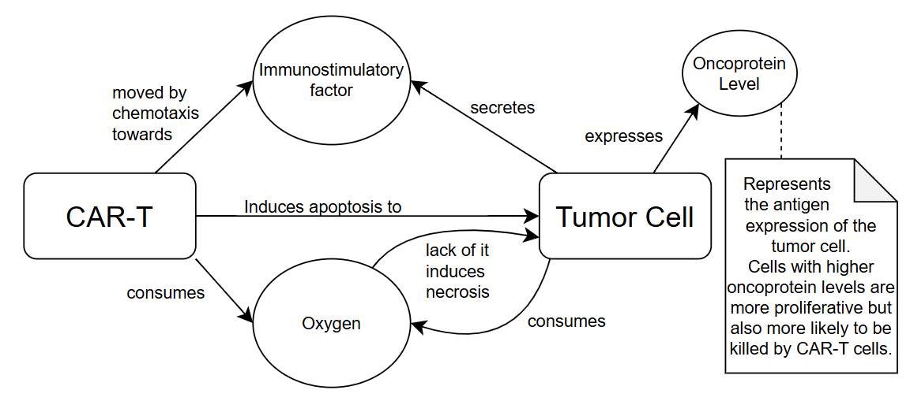


The project is organized into the following components:

### Core Simulation Files (`src/`)

- **[`tumor_cell.h`](src/tumor_cell.h) / [`tumor_cell.cc`](src/tumor_cell.cc)**: Defines tumor cells with four states (alive, necrotic swelling, necrotic lysed, apoptotic), four types based on oncoprotein levels, volume dynamics using exponential relaxation, oxygen/immunostimulatory factor exchange, and the [`StateControlGrowProliferate`](src/tumor_cell.h) behavior for cancer growth and state transitions.

- **[`cart_cell.h`](src/cart_cell.h) / [`cart_cell.cc`](src/cart_cell.cc)**: Implements CAR-T cells with alive/apoptotic states, tumor cell attachment/detachment mechanisms, stochastic killing attempts, chemotaxis toward immunostimulatory factors, finite lifespan, and the [`StateControlCart`](src/cart_cell.h) behavior.

- **[`cart_tumor.h`](src/cart_tumor.h) / [`cart_tumor.cc`](src/cart_tumor.cc)**: Contains the main [`Simulate`](src/cart_tumor.cc) function that configures BioDynaMo, creates diffusion grids for oxygen and immunostimulatory factors, initializes the tumor sphere, sets up custom mechanical forces, and schedules treatment/output operations.

- **[`forces_tumor_cart.h`](src/forces_tumor_cart.h) / [`forces_tumor_cart.cc`](src/forces_tumor_cart.cc)**: Implements the [`InteractionVelocity`](src/forces_tumor_cart.h) class with velocity-dependent repulsion and adhesion forces between cells, with differentiated force coefficients for tumor-tumor, CAR-CAR, and tumor-CAR interactions.

- **[`diffusion_thomas_algorithm.h`](src/diffusion_thomas_algorithm.h) / [`diffusion_thomas_algorithm.cc`](src/diffusion_thomas_algorithm.cc)**: Solves the 3D diffusion equation (∂t u = ∇D∇u - μu) for chemical substances (oxygen and immunostimulatory factors) using the Thomas algorithm and Alternating Direction Implicit (ADI) method for tridiagonal systems in each spatial direction. Supports Dirichlet boundary conditions and integrates cellular consumption/secretion (∂ρ/∂t = ∇·(D∇ρ) − λ·ρ + Σ[(V_k/V_voxel)·(S_k·(ρ*_k − ρ) − (S_k + U_k)·ρ)]) through [`ComputeConsumptionsSecretions`](src/diffusion_thomas_algorithm.cc), which updates concentrations based on cell-specific uptake and secretion rates.

- **[`hyperparams.h`](src/hyperparams.h) / [`hyperparams.cc`](src/hyperparams.cc)**: Contains the [`SimParam`](src/hyperparams.h) class with default biological/simulation parameters and treatment schedule definition. Provides [`LoadParams`](src/hyperparams.cc) to read configuration from [`params.json`](params.json) and [`PrintParams`](src/hyperparams.cc) to display current parameter values.

- **[`utils_aux.h`](src/utils_aux.h) / [`utils_aux.cc`](src/utils_aux.cc)**: Provides utility functions ([`SamplePositiveGaussian`](src/utils_aux.cc), [`CreateSphereOfTumorCells`](src/utils_aux.cc), [`AnalyzeTumor`](src/utils_aux.cc), [`GenerateRandomDirection`](src/utils_aux.cc)) and operations ([`SpawnCart`](src/utils_aux.cc) for dosage administration, [`OutputSummary`](src/utils_aux.cc) for CSV data export to `/output/final_data.csv`).
### Configuration Files

- **[`params.json`](params.json)**: JSON-formatted parameter file for configuring simulation runs without recompilation.

- **[`bdm.toml`](bdm.toml)**: BioDynaMo-specific configuration for visualization settings.

- **[`CMakeLists.txt`](CMakeLists.txt)**: CMake build configuration that integrates with BioDynaMo and sets up the C++17 project structure. Modification is typically not required.

### Analysis

- **[`CARTopiaX_Simulation_Analysis.ipynb`](CARTopiaX_Simulation_Analysis.ipynb)**: Jupyter notebook for post-processing simulation results, generating plots, and statistical analysis.


---

## Model Replication

All plots in this section compare CARTopiaX with the model results from the *Nature* paper over five runs, demonstrating **successful replication** and reproducing the same **biological findings**. Even though the graphs do not always overlap, this is due to substantial known differences in their modeling approaches and stochastic nature. What is important is that the overall behaviors and key biological dynamics are accurately reproduced, as researchers primarily focus on these trends and peak responses when designing treatments.

### Replication Example: Tumor with no CAR-T treatment
---
The following example reproduces the 30-day evolution of a 150 µm radius tumor simulation with no CAR T-cell treatment applied. The plot below shows the total number of cancer cells and the tumor radius over time:

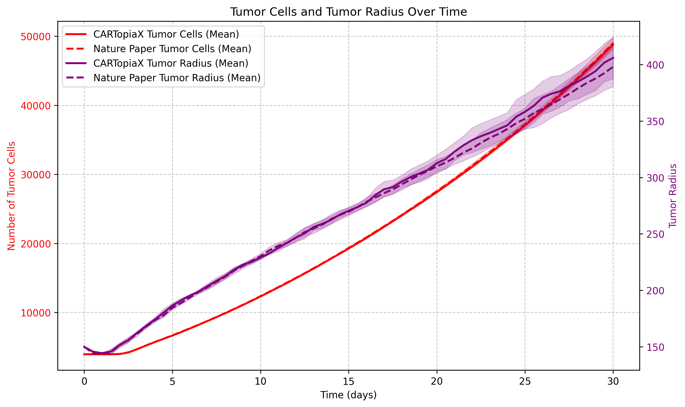

#### Tumor Heterogeneity:

CARTopiaX models a **heterogeneous tumor**, where cancer cells differ in their *oncoprotein expression levels*, representing varying proliferative capacities.  
Although oncoprotein levels are continuous, cells are grouped into four discrete categories:

| Type | Oncoprotein Level     | Aggressiveness       |
|:----:|:---------------------:|:--------------------:|
| 1    | 1.5 < Oncoprotein ≤ 2 | Most proliferative   |
| 2    | 1 < Oncoprotein ≤ 1.5 | Very proliferative   |
| 3    | 0.5 < Oncoprotein ≤ 1 | Less proliferative   |
| 4    | 0 ≤ Oncoprotein ≤ 0.5 | Least proliferative  |

Tumor evolution visualized in ParaView:

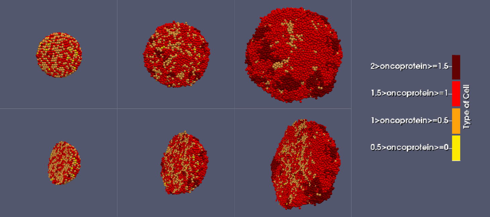

Type 1 cells are highly proliferative, causing their proportion in the tumor to increase, while Type 3–4 cells divide less frequently and, struggling in a oxygen-limited, resource-competitive environment, gradually become less common:

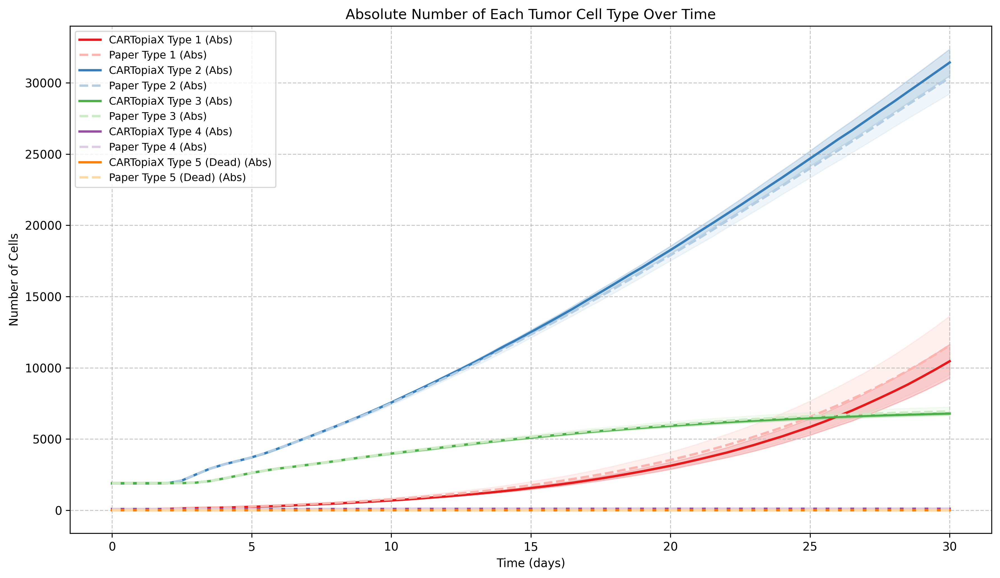

As cell quantity rises, **oxygen levels drop** due to increased consumption, while the average **oncoprotein level gradually increases** because more proliferative cells pass their higher oncoprotein levels to their progeny over time.

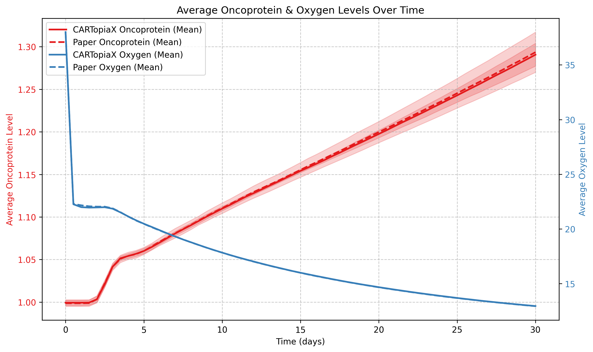


### Replication Example: One CAR T-cell dose of Scale 1:1
---
The following example models the same 150 µm-radius tumor, but with a single CAR T-cell dose, equal in number to the tumor cells administered, on day 0. The CAR T-cell population then declines stochastically due to apoptosis, reaching minimal levels around day 10. The plot below shows the total tumor and CAR T-cell populations over time:

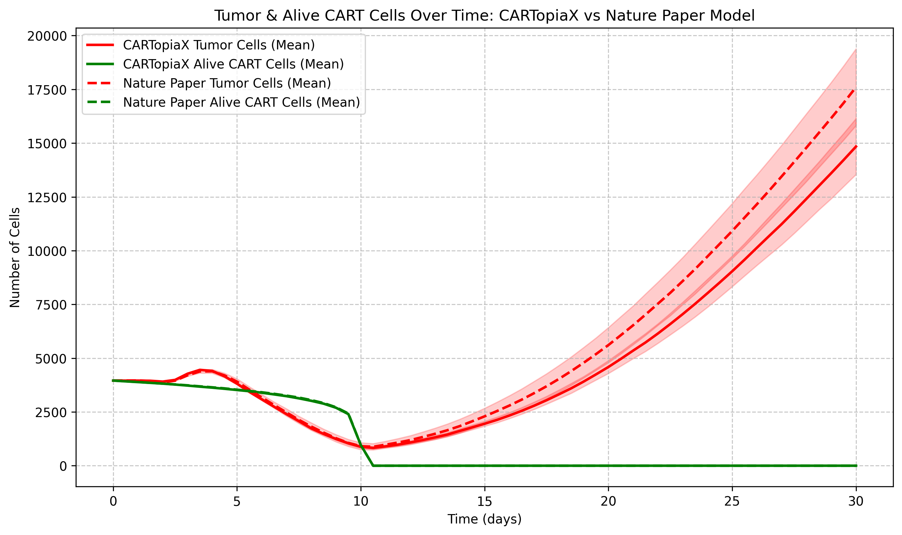

All cells consume oxygen, and cancer cells can die from **necrosis** in its absence. In addition, CAR T-cells tend to **eliminate higher oncoprotein-expressing cells more effectively**, leading to the following dynamics:

<u>Before day 10:</u> CAR T-cells are actively killing tumor cells and **Type 1 and 2 cell populations decrease** as more proliferative cancer cells are targeted.

<u>After day 10:</u> When CAR T-cells die from apoptosis, **Type 1 and 2 cells increase** their proportion in the tumor at the expense of Type 3 and 4 cells, as high-oncoprotein expressers divide faster.

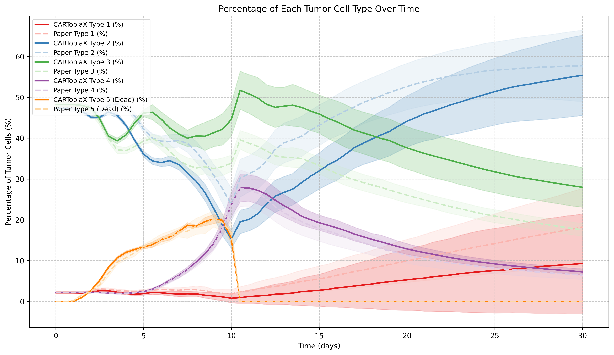

<u>Before day 10:</u> In the beginning, **oxygen** levels decrease with CAR T-cell arrival. Then they **gradually rise** as both CAR T-cells and tumor cells die, reducing overall consumption. On the other hand, the **average oncoprotein level drops** rapidly due to CAR T-cell preferential elimination of the most aggressive cancer cells.

<u>After day 10:</u> CAR T-cells are no longer present and therefore tumor resumes growth, making **oxygen levels decline**. In addition, **oncoprotein levels rise** as highly proliferative cells dominate once again.

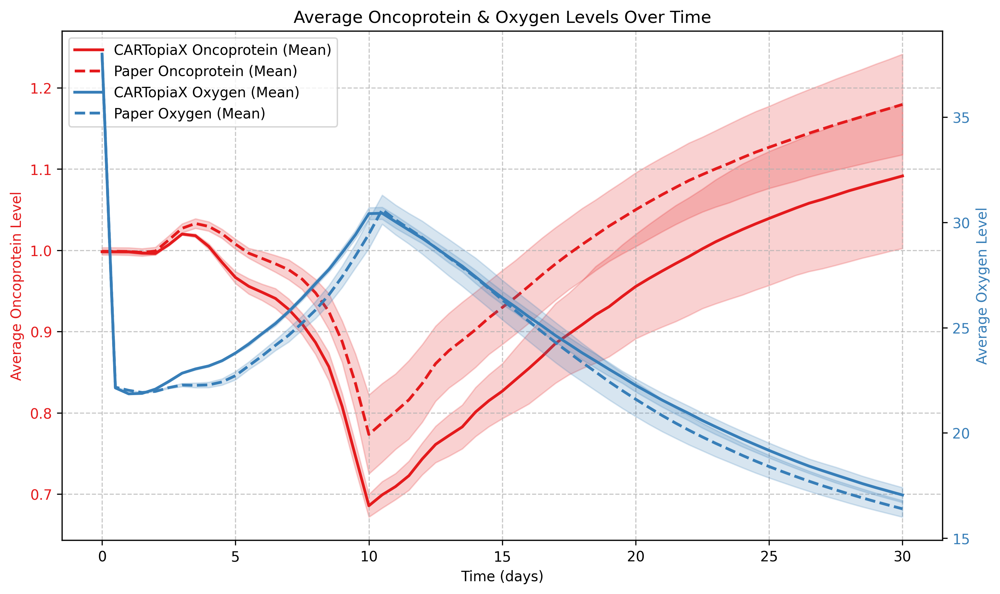

During the simulation, **dead and resistant cells** accumulate around the tumor core, forming a ***shield-like barrier*** that impedes CAR T-cell infiltration and reduces treatment effectiveness.

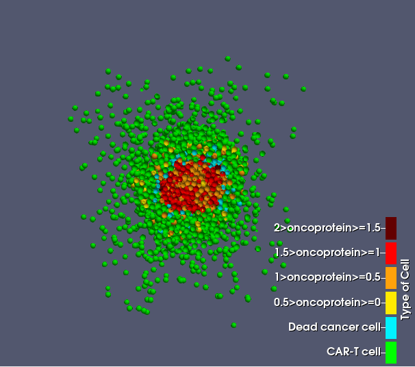

A 3D visualization of the sliced tumor and CAR T-cell treatment used in this example, rendered in *ParaView*, is available here:  
[Watch the simulation video](https://youtu.be/7V8n627Nmzc)

### Replication Example: Less is better, increasing cellular dosage does not always increase efficacy

---
We consider again the 150 µm-radius tumor and now **two CAR T-cell doses of scale 1:1** (equal in number to the initial tumor cells) are delivered on days 0 and 8. This way much less tumor cells are present at day 30 in comparison to applying just one dose:

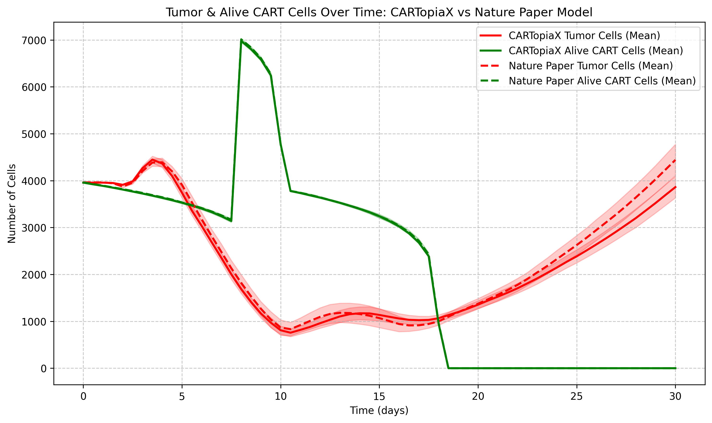

Delivering more CAR T-cells has helped in controlling the tumor, however this is not always the case. The next plot shows the same initial tumor but with two CAR T-cell doses containing a quantity twice the initial tumor cell count, on days 0 and 5. By day 30, the number of **tumor cells is roughly the same** as before, despite using **twice the amount of CAR T-cells**.

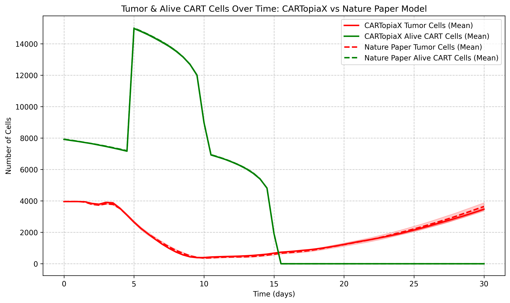


Increasing CAR T-cell dosage does not necessarily improve tumor killing and can increase *toxicity*. The model suggests two doses at a 1:1 CAR T-to-cancer cell ratio, balancing effectiveness and safety, minimizing inactive *free* CAR T-cells.

### Performance
---

CARTopiaX successfully replicates the findings described in the *Nature* publication, achieving a **2× speed improvement** compared to the previous implementation.  
This performance gain enables faster scenario exploration and larger-scale simulations.

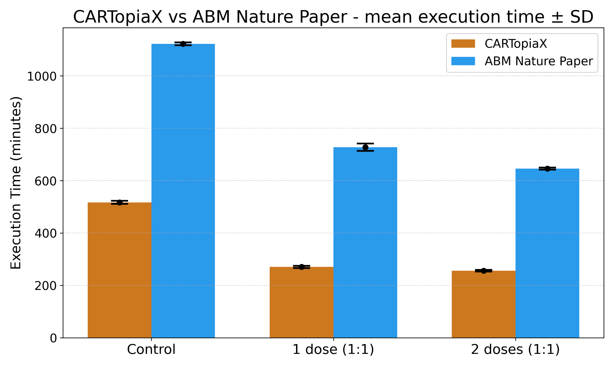

---

## Dependencies

- [BioDynaMo](https://biodynamo.org/) (tested with version 1.05.132)
- CMake ≥ 3.13
- GCC or Clang with C++17 support
- GoogleTest (for unit testing)

**Note:** Ensure BioDynaMo is installed and sourced before running the simulation.

---

## Installation

Clone the repository:
```bash
git clone https://github.com/compiler-research/CARTopiaX.git
cd CARTopiaX

```

---

## Building the Simulation

**Option 1:**
Use BioDynaMo’s build system:
```bash
biodynamo build
```

**Option 2:**
Manual build:
```bash
mkdir build && cd build
cmake ..
make -j <number_of_processes>
```

---

## Input Parameters

All hyperparameters are modifiable by giving them a value in the `params.json` without the need to recompile the model after changing them. When a value is not specified the default values are taken. Some hyperparameters are derived from others by default but they can still be set to arbitrary values if wished. Don't worry if you modify a hyperparameter in `params.json` but not its derived values; by default, derived values are computed at the start of the simulation based on the specified ones.

### General Simulation Parameters

These are basic parameters that are commonly changed when designing a treatment with CARTopiaX.


| Parameter | Default Value | Units | Description |
|-----------|---------------|-------|-------------|
| `seed` | 1 | - | Seed for random number generation to ensure reproducibility |
| `output_performance_statistics` | false | - | Enable/disable performance statistics output |
| `total_minutes_to_simulate` | 43200 | minutes | Total simulation time (default: 30 days) |
| `initial_tumor_radius` | 150 | μm | Initial radius of the spherical tumor |
| `bounded_space_length` | 1000 | μm | Length of the cubic simulation domain |
| `treatment` | `{0: 3957, 8: 3957}` | day:cells | Map of treatment days to CAR-T cell counts. Key = day, Value = number of cells |

### Specific Parameters: 
These are all the other hyperparameters that are not adviced to be modified unless having a deeper understanding of the model and code.


#### Time Step Parameters

| Parameter | Default Value | Units | Description |
|-----------|---------------|-------|-------------|
| `dt_substances` | 0.01 | minutes | Time step for diffusion and substance exchange |
| `dt_mechanics` | 0.1 | minutes | Time step for mechanical forces between cells |
| `dt_cycle` | 6 | minutes | Time step for cell cycle progression |
| `dt_step` | 0.1 | minutes | General simulation time step (same as `dt_mechanics`) |
| `output_csv_interval` | 7200 | steps | Interval for writing simulation data to CSV (default: 12 hours) |

#### Apoptosis Parameters

| Parameter | Default Value | Units | Description |
|-----------|---------------|-------|-------------|
| `volume_relaxation_rate_cytoplasm_apoptotic_cells` | 0.0166667 | min⁻¹ | Cytoplasm volume relaxation rate for apoptotic cells |
| `volume_relaxation_rate_nucleus_apoptotic_cells` | 0.00583333 | min⁻¹ | Nucleus volume relaxation rate for apoptotic cells |
| `volume_relaxation_rate_fluid_apoptotic_cells` | 0.0 | min⁻¹ | Fluid volume relaxation rate for apoptotic cells |
| `time_apoptosis` | 516 | minutes | Time until an apoptotic cell is removed from simulation |
| `reduction_consumption_dead_cells` | 0.1 | - | Reduction factor for oxygen consumption in dead cells |

#### Chemical Diffusion Parameters

| Parameter | Default Value | Units | Description |
|-----------|---------------|-------|-------------|
| `resolution_grid_substances` | 50 | voxels/axis | Number of voxels per axis for diffusion grids |
| `diffusion_coefficient_oxygen` | 100000 | μm²/min | Diffusion coefficient for oxygen |
| `decay_constant_oxygen` | 0.1 | min⁻¹ | Decay constant (λ) for oxygen |
| `diffusion_coefficient_immunostimulatory_factor` | 1000 | μm²/min | Diffusion coefficient for immunostimulatory factor |
| `decay_constant_immunostimulatory_factor` | 0.016 | min⁻¹ | Decay constant (λ) for immunostimulatory factor |
| `oxygen_reference_level` | 38 | mmHg | Boundary condition value for oxygen concentration |
| `initial_oxygen_level` | 38 | mmHg | Initial oxygen concentration in all voxels |
| `oxygen_saturation` | 30 | mmHg | Oxygen saturation level in the microenvironment |

#### Mechanical Forces Parameters

| Parameter | Default Value | Units | Description |
|-----------|---------------|-------|-------------|
| `cell_repulsion_between_tumor_tumor` | 10 | - | Repulsion coefficient between tumor cells |
| `cell_repulsion_between_cart_cart` | 50 | - | Repulsion coefficient between CAR-T cells |
| `cell_repulsion_between_cart_tumor` | 50 | - | Repulsion coefficient from CAR-T to tumor cells |
| `cell_repulsion_between_tumor_cart` | 10 | - | Repulsion coefficient from tumor to CAR-T cells |
| `max_relative_adhesion_distance` | 1.25 | - | Maximum relative distance for adhesion (multiplier of cell radius) |
| `cell_adhesion_between_tumor_tumor` | 0.4 | - | Adhesion coefficient between tumor cells |
| `cell_adhesion_between_cart_cart` | 0 | - | Adhesion coefficient between CAR-T cells |
| `cell_adhesion_between_cart_tumor` | 0 | - | Adhesion coefficient from CAR-T to tumor cells |
| `cell_adhesion_between_tumor_cart` | 0 | - | Adhesion coefficient from tumor to CAR-T cells |
| `length_box_mechanics` | 22 | μm | Box length for spatial partitioning in force calculations |
| `dnew` | 0.15 | - | Adams-Bashforth coefficient for current velocity (dt × 1.5) |
| `dold` | -0.05 | - | Adams-Bashforth coefficient for previous velocity (dt × -0.5) |
| `max_squared_distance_cart_moving_towards_tumor_cell` | 317.746 | μm² | Maximum squared distance for CAR-T adhesion-only movement |

#### Tumor Cell Parameters

| Parameter | Default Value | Units | Description |
|-----------|---------------|-------|-------------|
| `rate_secretion_immunostimulatory_factor` | 10 | 1/min | Secretion rate of immunostimulatory factor by tumor cells |
| `saturation_density_immunostimulatory_factor` | 1 | - | Saturation density for immunostimulatory factor secretion |
| `oncoprotein_mean` | 1 | - | Mean oncoprotein expression level in tumor cells |
| `oncoprotein_standard_deviation` | 0.25 | - | Standard deviation of oncoprotein expression |
| `oncoprotein_limit` | 0.5 | - | Minimum oncoprotein level for CAR-T recognition |
| `oncoprotein_saturation` | 2.0 | - | Maximum oncoprotein level |
| `oxygen_saturation_for_proliferation` | 38 | mmHg | Oxygen level for maximum proliferation rate |
| `oxygen_limit_for_proliferation` | 10 | mmHg | Minimum oxygen level for cell proliferation |
| `oxygen_limit_for_necrosis` | 5 | mmHg | Oxygen level below which necrosis begins |
| `oxygen_limit_for_necrosis_maximum` | 2.5 | mmHg | Oxygen level for maximum necrosis probability |
| `time_lysis` | 86400 | minutes | Time until lysed necrotic cell removal |
| `maximum_necrosis_rate` | 0.00277778 | min⁻¹ | Maximum necrosis rate at 0 oxygen (1/360 min⁻¹) |
| `default_oxygen_consumption_tumor_cell` | 10 | 1/min | Baseline oxygen consumption rate of tumor cells |
| `default_volume_new_tumor_cell` | 2494 | μm³ | Total volume of newly created tumor cell |
| `default_volume_nucleus_tumor_cell` | 540 | μm³ | Nuclear volume of newly created tumor cell |
| `default_fraction_fluid_tumor_cell` | 0.75 | - | Fraction of cytoplasmic volume that is fluid |
| `average_time_transformation_random_rate` | 38.6 | hours | Mean cell cycle duration |
| `standard_deviation_transformation_random_rate` | 3.7 | hours | Standard deviation of cell cycle duration |
| `adhesion_time` | 60 | minutes | Average time tumor cell remains attached to CAR-T before escaping |

<u>Tumor Cell Volume Relaxation Rates</u>

| Parameter | Default Value | Units | Description |
|-----------|---------------|-------|-------------|
| `volume_relaxation_rate_alive_tumor_cell_cytoplasm` | 0.00216667 | min⁻¹ | Cytoplasm relaxation rate for alive tumor cells |
| `volume_relaxation_rate_alive_tumor_cell_nucleus` | 0.00366667 | min⁻¹ | Nucleus relaxation rate for alive tumor cells |
| `volume_relaxation_rate_alive_tumor_cell_fluid` | 0.0216667 | min⁻¹ | Fluid relaxation rate for alive tumor cells |
| `volume_relaxation_rate_cytoplasm_necrotic_swelling_tumor_cell` | 5.33333e-05 | min⁻¹ | Cytoplasm relaxation rate during necrotic swelling |
| `volume_relaxation_rate_nucleus_necrotic_swelling_tumor_cell` | 0.000216667 | min⁻¹ | Nucleus relaxation rate during necrotic swelling |
| `volume_relaxation_rate_fluid_necrotic_swelling_tumor_cell` | 0.000833333 | min⁻¹ | Fluid relaxation rate during necrotic swelling |
| `volume_relaxation_rate_cytoplasm_necrotic_lysed_tumor_cell` | 5.33333e-05 | min⁻¹ | Cytoplasm relaxation rate during necrotic lysis |
| `volume_relaxation_rate_nucleus_necrotic_lysed_tumor_cell` | 0.000216667 | min⁻¹ | Nucleus relaxation rate during necrotic lysis |
| `volume_relaxation_rate_fluid_necrotic_lysed_tumor_cell` | 0.000833333 | min⁻¹ | Fluid relaxation rate during necrotic lysis |

<u>Tumor Cell Type Thresholds</u>

| Parameter | Default Value | Units | Description |
|-----------|---------------|-------|-------------|
| `threshold_cancer_cell_type1` | 1.5 | - | Oncoprotein threshold for Type 1 (most aggressive) |
| `threshold_cancer_cell_type2` | 1.0 | - | Oncoprotein threshold for Type 2 |
| `threshold_cancer_cell_type3` | 0.5 | - | Oncoprotein threshold for Type 3 |
| `threshold_cancer_cell_type4` | 0.0 | - | Oncoprotein threshold for Type 4 (least aggressive) |

#### CAR-T Cell Parameters

| Parameter | Default Value | Units | Description |
|-----------|---------------|-------|-------------|
| `average_maximum_time_untill_apoptosis_cart` | 86400 | minutes | Average CAR-T cell lifespan (60 days) |
| `default_oxygen_consumption_cart` | 1 | 1/min | Baseline oxygen consumption rate of CAR-T cells |
| `default_volume_new_cart_cell` | 2494 | μm³ | Total volume of newly created CAR-T cell |
| `kill_rate_cart` | 0.06667 | min⁻¹ | Rate at which CAR-T attempts to kill attached tumor cell |
| `adhesion_rate_cart` | 0.013 | min⁻¹ | Rate at which CAR-T attempts to attach to tumor cells |
| `max_adhesion_distance_cart` | 18 | μm | Maximum distance for CAR-T to tumor cell attachment |
| `min_adhesion_distance_cart` | 14 | μm | Minimum distance for CAR-T to tumor cell attachment |
| `minimum_distance_from_tumor_to_spawn_cart` | 50 | μm | Minimum distance from tumor boundary to spawn CAR-T cells |

<u>CAR-T Cell Motility Parameters</u>

| Parameter | Default Value | Units | Description |
|-----------|---------------|-------|-------------|
| `persistence_time_cart` | 10 | minutes | Average time before CAR-T changes direction |
| `migration_bias_cart` | 0.5 | - | Chemotaxis bias toward immunostimulatory factor (0=random, 1=fully directed) |
| `migration_speed_cart` | 5 | μm/min | CAR-T cell migration speed |
| `elastic_constant_cart` | 0.01 | - | Elastic constant for CAR-T cell motility |

### Parameter Configuration

To modify parameters, edit the [`params.json`](params.json) file. Only include parameters you want to change from their default values. Example:

```json
{
  "seed": 1,
  "output_performance_statistics": true,
  "total_minutes_to_simulate": 43200,
  "initial_tumor_radius": 150.0,
  "treatment": {
    "0": 3957,
    "8": 3957
  }
}
```

---

## Running the Simulation

After building, run the simulation using one of the following methods:

**Option 1:**
With BioDynaMo:
```bash
biodynamo run
```

**Option 2:**
Directly from the build directory:
```bash

./build/CARTopiaX
```

---

## Visualizing Results

Data about tumor growth, different types of cell populations and oxygen and oncoprotein levels are output in `./output/final_data.csv` To visualize plots that give an overview of the results of the simulation you can run the provided python notebook `./CARTopiaX_Simulation_Analysis.ipynb`

To visualize the 3D model of the execution in ParaView use:
```bash
paraview ./output/CARTopiaX/CARTopiaX.pvsm

```

---

## Acknowledgments

This project builds upon the BioDynaMo simulation framework.

> Lukas Breitwieser, Ahmad Hesam, Jean de Montigny, Vasileios Vavourakis, Alexandros Iosif, Jack Jennings, Marcus Kaiser, Marco Manca, Alberto Di Meglio, Zaid Al-Ars, Fons Rademakers, Onur Mutlu, Roman Bauer.
> *BioDynaMo: a modular platform for high-performance agent-based simulation*.
> Bioinformatics, Volume 38, Issue 2, January 2022, Pages 453–460.
> [https://doi.org/10.1093/bioinformatics/btab649](https://doi.org/10.1093/bioinformatics/btab649)

CARTopiaX is based on the mathematical models and solver implementations from the research of
Luciana Melina Luque and collaborators, to replicate its findings:

> Luque, L.M., Carlevaro, C.M., Rodriguez-Lomba, E. et al.
> *In silico study of heterogeneous tumour-derived organoid response to CAR T-cell therapy*.
> Scientific Reports 14, 12307 (2024).
> [https://doi.org/10.1038/s41598-024-63125-5](https://doi.org/10.1038/s41598-024-63125-5)

---

## License

This project is licensed under the Apache License 2.0. See the [LICENSE](LICENSE) file for details.

---
## Author Contact Information
**Author:** Salvador de la Torre Gonzalez  
You can check my profile at Princeton University's [Compiler Research Team](https://compiler-research.org/team/SalvadordelaTorreGonzalez). 
Do not hesitate to reach out in case of having questions, email: *delatorregonzalezsalvador at gmail.com*

**Coauthor:** [Luciana Melina Luque](https://www.lmluque.com/)
